# 🛍️ Ultimate Clothing Store Ecosystem

A comprehensive, professional-grade e-commerce solution featuring a robust **Laravel API**, a dynamic **React/Vite Web Dashboard**, and a sleek **Flutter Mobile Application**.

[](https://laravel.com)
[](https://reactjs.org)
[](https://flutter.dev)
[](LICENSE)

---

## 🚀 Overview

This project is a full-stack ecosystem designed for modern clothing retail. It provides a seamless experience for both customers (via Mobile App) and administrators (via Web Dashboard), all powered by a high-performance RESTful API.

### ✨ Key Features

- **Backend (Laravel):**
  - Secure JWT Authentication.
  - Advanced Order Management & Lifecycle.
  - Inventory & Category Tracking.
  - Real-time Notifications via Firebase.
- **Web Dashboard (React + Vite):**
  - Premium UI with Shadcn/UI & Tailwind CSS.
  - Real-time Sales Analytics.
  - Product & Inventory Management.
  - User & Role Management.
- **Mobile App (Flutter):**
  - Smooth, Native UI/UX.
  - Firebase Integration for Auth & Messaging.
  - Dynamic Product Catalog & Search.
  - Real-time Order Tracking.

---

## 🏗️ Architecture

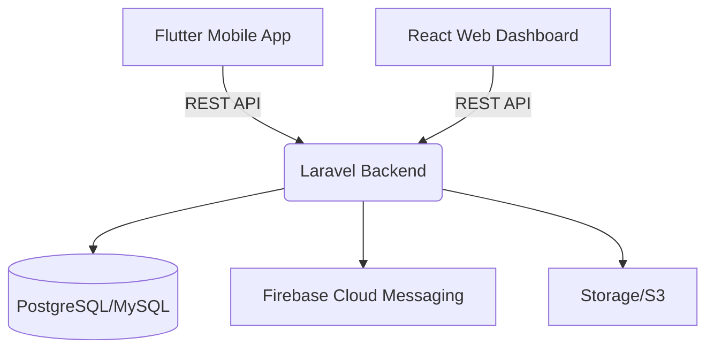

---

## 📂 Project Structure

```text
.
├── backend/             # Laravel 11 API
├── frontend-web/        # React + Vite Dashboard
├── frontend-mobile/     # Flutter Mobile Application
├── docs/                # Documentation & API Specs
├── scripts/             # Maintenance & Utility Scripts
└── LICENSE              # MIT License
```

---

## 🛠️ Quick Start

### 1. Backend Setup
```bash
cd backend
composer install
cp .env.example .env
php artisan key:generate
php artisan migrate --seed
php artisan serve
```

### 2. Web Dashboard Setup
```bash
cd frontend-web
npm install
npm run dev
```

### 3. Mobile App Setup
```bash
cd frontend-mobile
flutter pub get
flutter run
```

---

## 📸 Gallery

### 📱 Mobile Application
<div align="center">
  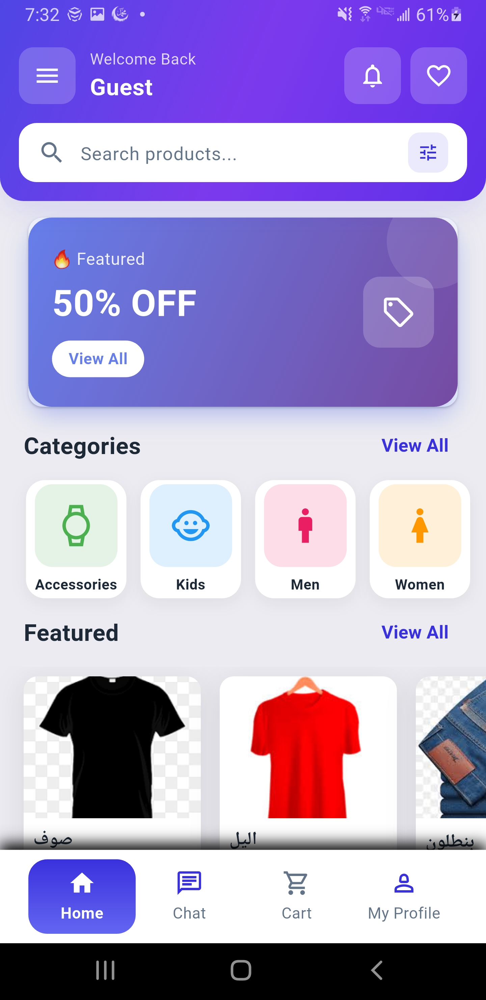
  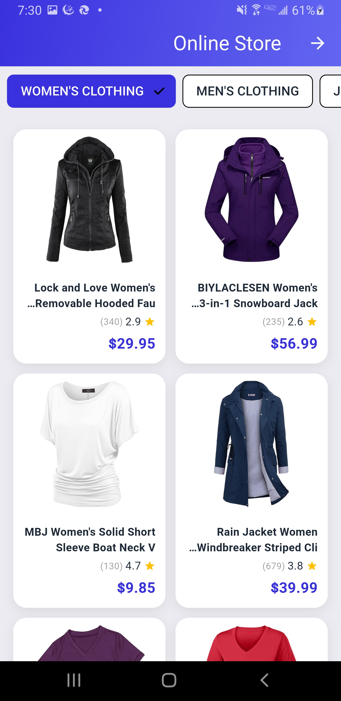
  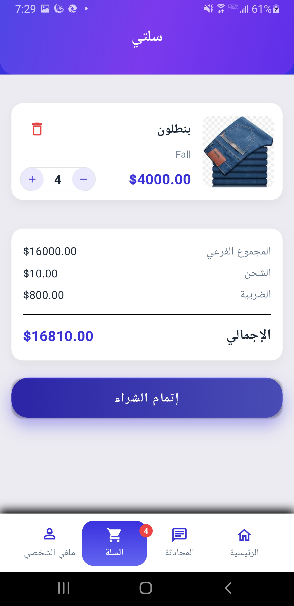
  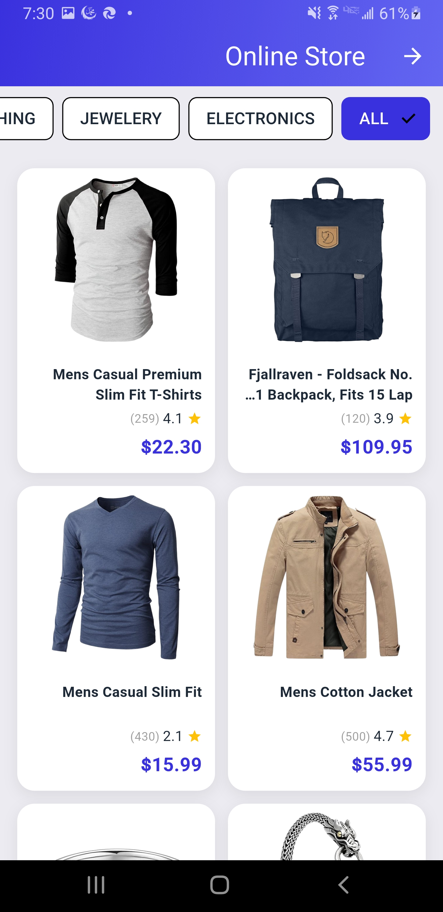
</div>
<br>
<div align="center">
  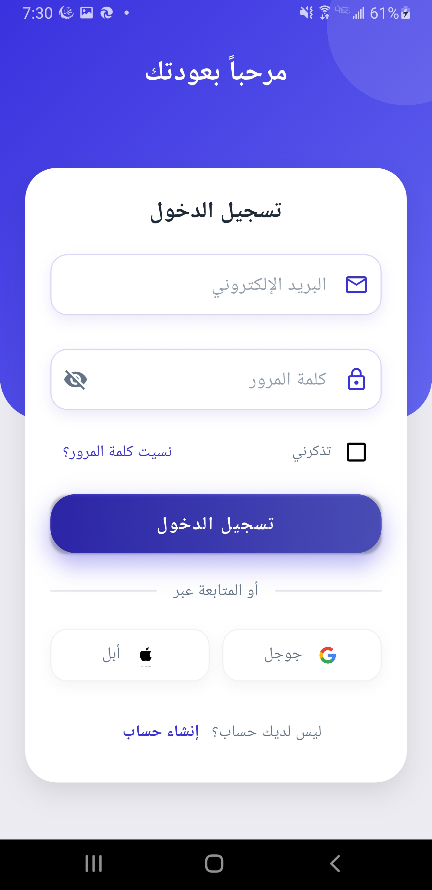
  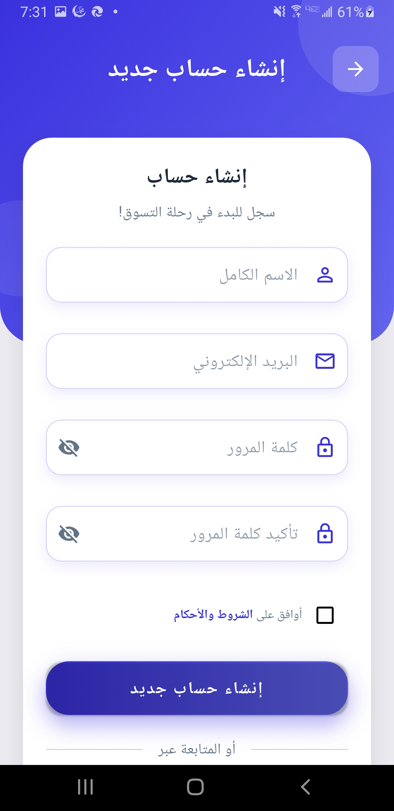
  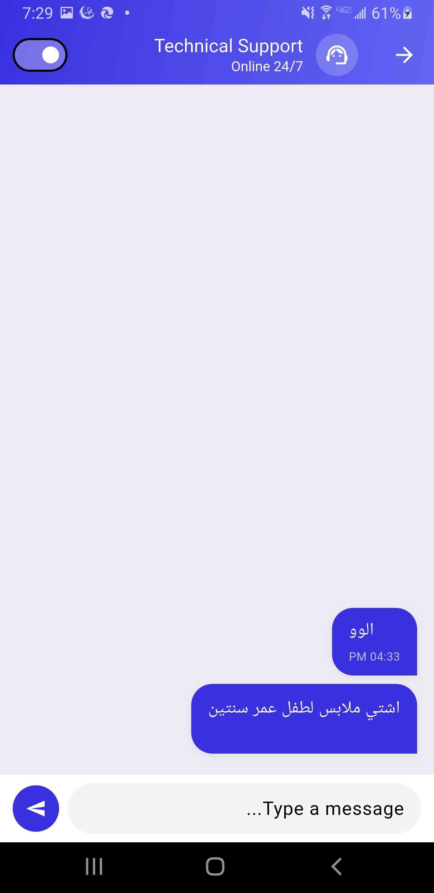
  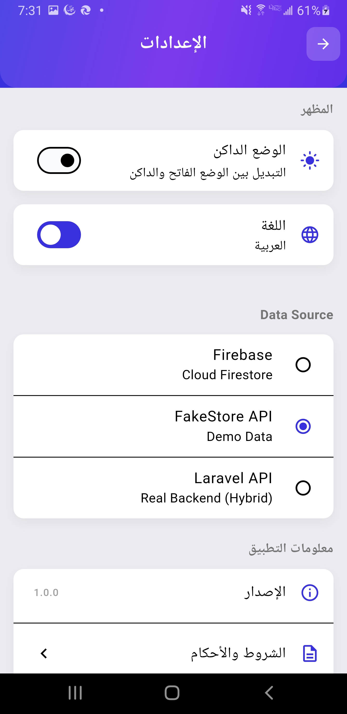
</div>

### 💻 Web Dashboard
<div align="center">
  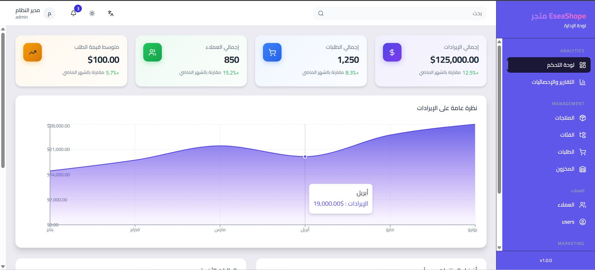
  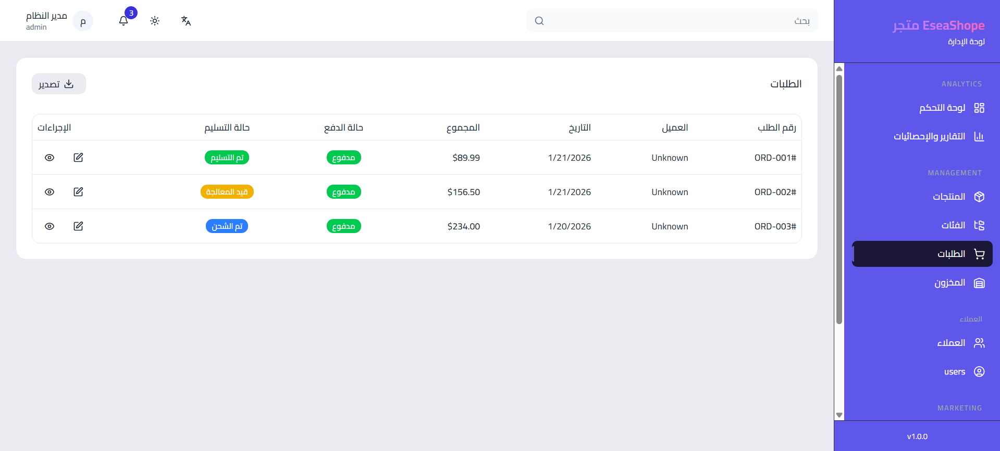
</div>

---

## 🤝 Contributing

Contributions are welcome! Please feel free to submit a Pull Request.

## 📄 License

This project is licensed under the MIT License - see the [LICENSE](LICENSE) file for details.

---
<p align="center">Made with ❤️ for the Developer Community</p>
