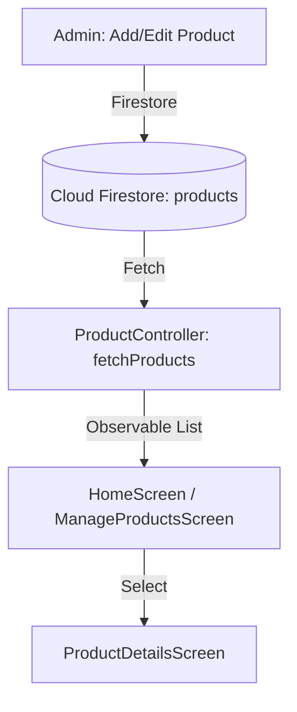
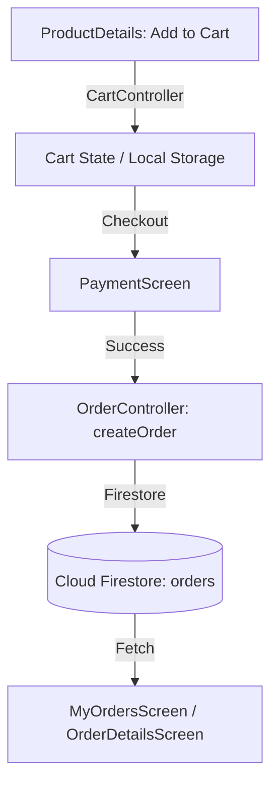

# Data Flow Analysis

This document outlines the lifecycle of products and orders within the application.

## 1. Product Lifecycle

The product data flow starts from the Admin panel and ends in the User's view.

### Key Components:
- **Admin Panel**: Where products are created or seeded using `DatabaseSeeder`.
- **Cloud Firestore**: The source of truth for all product data.
- **ProductController**: Manages the state of products using GetX observables.
- **UI Screens**: Display the data to the user.

---

## 2. Order Lifecycle

The order data flow starts from the User's cart and ends with a confirmed order in the database.

### Key Components:
- **CartController**: Manages the temporary state of items the user wants to buy.
- **PaymentScreen**: Handles the transaction logic.
- **OrderController**: Responsible for persisting the order to Firestore and fetching order history.
- **Cloud Firestore**: Stores the final order details.
